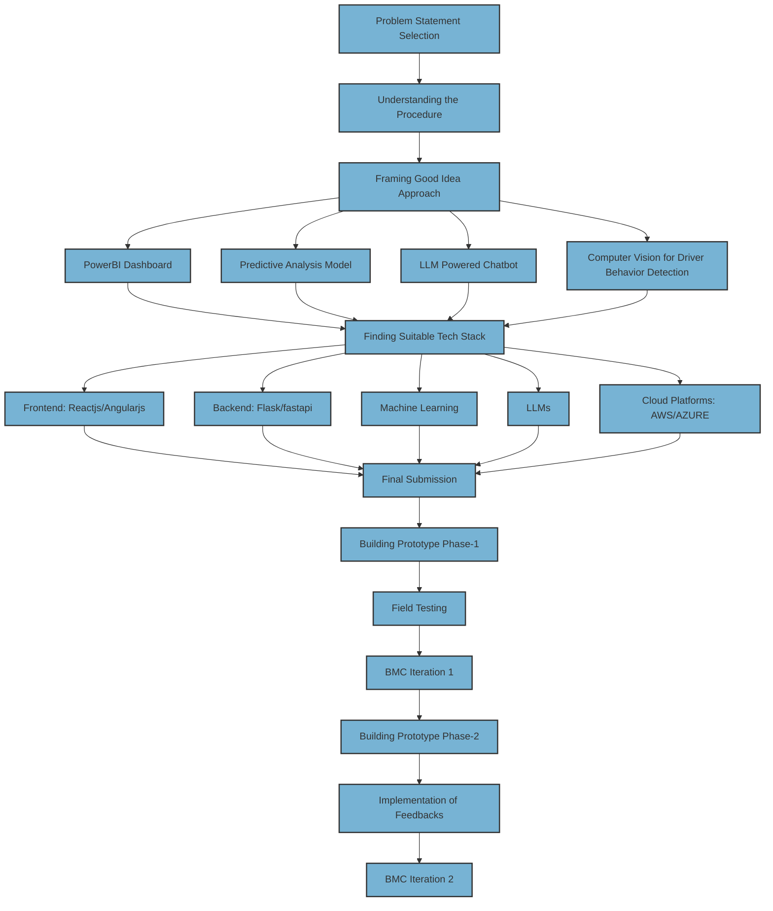

# Story of Innovation: From Accidents Data to Data Analysis Visualization 

## Problem Statement :
Traditional methods for analyzing accident data lack insights into patterns and contributing factors, limiting the potential for effective prevention strategies. Police store and record a huge volume of data relating to accidents, this data is seldom used to analyze and predict the accident pattern. The problem is to analyze the accident data to determine the cause or causes of an accident to identify the contributing factors of the accident which may be related to the behavior of the person or may be related to the structural design or infrastructure of the road and to predict the future occurrences of the accidents It also includes a plan to prevent further accidents of a similar kind by influencing the people through awareness and enforcement and also through engineering solutions.

## Executive Summary :
The analysis of accident data collected by the police reveals significant untapped potential for understanding and preventing accidents. Despite the vast volume of stored data, it is often underutilized for analyzing accident patterns and predicting future occurrences. This presents a critical opportunity to identify the multifaceted causes of accidents, including factors related to human behavior, road infrastructure, and structural design. By delving into the data, we can uncover the underlying causes of accidents, whether they stem from individual behaviors or deficiencies in road design. Utilizing advanced analytical techniques, we can forecast future accident occurrences, enabling proactive measures to mitigate risks and prevent similar incidents from happening again. To address these challenges effectively, a comprehensive strategy is proposed. This strategy encompasses raising public awareness through education and enforcement initiatives, influencing behavioral changes among road users. Additionally, engineering solutions aimed at enhancing road safety infrastructure play a crucial role in preventing accidents of similar nature. In summary, by leveraging the wealth of accident data available, implementing proactive measures, and fostering collaboration between various stakeholders, we can make substantial strides in reducing accidents and promoting safer road environments.

## Journey 

# BMC Iteration 1 :

# BMC Iteration 2 :

# POC :

[Demolink](https://app.powerbi.com/reportEmbed?reportId=43f2ead9-7854-4e76-9502-7cafff71a581&autoAuth=true&ctid=a3848dc7-6487-49c7-9ae0-a4324d34aefe)
### Screenshot 1 :

### Screenshot 2 :

### Screenshot 3 :

### Screenshot 4 : 

### Screenshot 5 :

### Screenshot 6 :

## Conclusion :

The journey from analyzing accident data to implementing data analysis visualization tools has been an enlightening and transformative experience. By addressing the longstanding issue of underutilized accident data, our innovative approach has paved the way for proactive accident prevention strategies and safer road environments.

